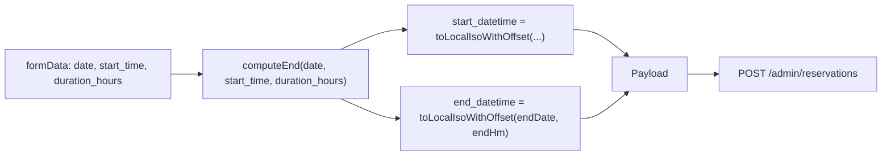

## 1. AddBookingModal: заменить «Дата/Время окончания» на «Кол-во часов»

[frontend/my-banya/src/pages/Admin/Reservations/AddBookingModal.jsx](frontend/my-banya/src/pages/Admin/Reservations/AddBookingModal.jsx)

### State
- В `formData` убрать `end_date` и `end_time`, добавить `duration_hours: 1` (число, шаг 0.5).
- В режиме редактирования (`booking`): рассчитать `duration_hours` из `(end - start) / 3600000`, округлив к шагу 0.5.

### Расчёт окончания и payload
- Локальный helper `computeEnd(date, start_time, duration_hours)` — собирает `Date` из `${date}T${start_time}` и прибавляет `duration_hours * 3600000`.
- В `validateForm` и `handleSubmit` использовать вычисленные `endDate`/`endTime`:
  - `start_datetime = toLocalIsoWithOffset(formData.date, formData.start_time)`
  - `end_datetime` собрать из `computeEnd(...)` (`formatLocalYmd` + `HH:MM` от полученного `Date`) и пропустить через тот же `toLocalIsoWithOffset`.
- Удалить из формы `end_date`/`end_time`, удалить `getEndTimeOptions` (больше не нужно — переход через полночь обеспечивается арифметикой `Date`).

### Запрет прошлых даты/времени
- Добавить helper `getNowYmdHm()` -> `{ today: 'YYYY-MM-DD', nowHm: 'HH:MM' (округлённое вверх до 30 мин) }` (локальное время).
- В `<input type="date">` для «Дата начала» поставить `min={today}`.
- Время начала — текущий `select` с шагом 30 мин:
  - Если `formData.date === today` — фильтровать опции: оставлять только те, что `>= roundedNow`.
  - Если `<` сегодня — невозможно (запрещено через `min`).
  - В `useEffect` следить, чтобы при смене `formData.date` на сегодня и устаревшем `start_time` авто-выбирался первый валидный слот.
- В `validateForm` дополнительно проверить, что `new Date(start_datetime) >= new Date()` (с минутной точностью), показать ошибку `start_time = 'Нельзя выбрать прошлое время'`.

### Поле «Количество часов»
- `<input type="number" min="0.5" step="0.5">` или `<select>` со значениями 0.5, 1, 1.5, ... до 24 (или больше для многосуточных). Для простоты — `number` с `min=0.5`, `step=0.5`.
- В `validateForm`: `duration_hours > 0`.
- Подсказка о длительности уже есть (`calculateDuration`) — подкорректировать, чтобы брать `formData.duration_hours` и показывать «Окончание: дд.мм.гггг ЧЧ:ММ» при пересечении полуночи.

### Удалить из JSX
- Блоки «Дата окончания» (`grid-cols-2` -> оставить `Дата начала` и `Время начала` рядом, ниже добавить `Количество часов`).

## 2. Фильтр даты: клик по полю открывает календарь, без ручного ввода

[frontend/my-banya/src/pages/Admin/Reservations/ReservationsFilters.jsx](frontend/my-banya/src/pages/Admin/Reservations/ReservationsFilters.jsx)

- Использовать `formatLocalYmd(new Date())` вместо `toISOString().split('T')[0]` (заодно убираем UTC-сдвиг).
- В `<input type="date">`:
  - `readOnly` (запрещает ручной ввод, но не открытие пикера),
  - `onKeyDown={(e) => e.preventDefault()}` (блокировать клавиатуру),
  - `onClick={(e) => e.currentTarget.showPicker?.()}` и/или `onFocus` — открыть нативный календарь по клику в любое место поля,
  - оставить `value`/`onChange` как есть.
- `showPicker()` поддержан Chromium/Edge/Safari Tech Preview; в Firefox — graceful fallback (поле остаётся кликабельным как сейчас).

## 3. Поток данных (создание брони)

## Файлы

- [frontend/my-banya/src/pages/Admin/Reservations/AddBookingModal.jsx](frontend/my-banya/src/pages/Admin/Reservations/AddBookingModal.jsx)
- [frontend/my-banya/src/pages/Admin/Reservations/ReservationsFilters.jsx](frontend/my-banya/src/pages/Admin/Reservations/ReservationsFilters.jsx)