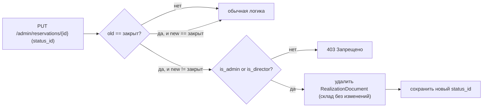

## Текущая логика (для контекста)

- При смене статуса на `закрыт` создаётся `RealizationDocument` без повторного списания (товары списываются ещё при создании брони). См. [backend/app/routers/admin_reservations.py](backend/app/routers/admin_reservations.py) ~строки 404–438.
- Смену статуса на фронте инициирует `handleStatusChange` в [frontend/my-banya/src/pages/Admin/Reservations/BookingDetailsModal.jsx](frontend/my-banya/src/pages/Admin/Reservations/BookingDetailsModal.jsx) (строки 86–107).
- Текущий пользователь и его флаги — в Redux: `state.auth.user` с `is_admin` / `is_director` (используется напр. в [frontend/my-banya/src/pages/Admin/Company/Staffs/UserForm.jsx](frontend/my-banya/src/pages/Admin/Company/Staffs/UserForm.jsx) `currentUser`).

## Поведение после изменений



## Backend

Файл: [backend/app/routers/admin_reservations.py](backend/app/routers/admin_reservations.py)

В `update_reservation` перед текущим блоком обработки статуса (~строка 394):

- Получить `old_status_name` через `db.query(ReservationStatus).filter(id == old_status_id).first().status_name`.
- Если меняется статус (`reservation.status_id is not None and reservation.status_id != old_status_id`) и `old_status_name == "закрыт"`:
  - Если `not (current_user.is_admin or current_user.is_director)` → `raise HTTPException(403, "Только администратор или директор может вернуть закрытую бронь в работу")`.
  - Иначе удалить связанные документы реализации (и их `items`):
    
    ```python
    docs = db.query(models.RealizationDocument).filter(
        models.RealizationDocument.reservation_id == id
    ).all()
    for d in docs:
        db.delete(d)  # items удалятся каскадом (cascade="all, delete-orphan")
    ```
  - Склад не трогаем (товары уже списаны при создании брони и должны остаться списанными).

Существующий блок «Если статус изменен на 'закрыт'» (строки 404–438) оставляем без изменений — он отвечает за обратное направление перехода в `закрыт`.

В аудит-логе можно добавить упоминание факта отката в `summary` (минимально: "Откатил бронь из 'закрыт' в '<новый>'") — опционально, не критично.

## Frontend

Файл: [frontend/my-banya/src/pages/Admin/Reservations/BookingDetailsModal.jsx](frontend/my-banya/src/pages/Admin/Reservations/BookingDetailsModal.jsx)

- Подключить пользователя: `const user = useSelector((s) => s.auth.user);`.
- Вычислить флаг блокировки селекта статуса:
  ```js
  const isClosed = booking.status === 'закрыт';
  const canRevert = !!(user?.is_admin || user?.is_director);
  const lockStatus = isClosed && !canRevert;
  ```
- Селект (строки 208–223): добавить `disabled={isSavingStatus || lockStatus}` и показать подсказку под полем при `lockStatus`: «Бронь закрыта. Изменить статус может только администратор или директор».
- В `handleStatusChange` обработать 403 от бэкенда: вернуть прежний статус и показать сообщение через существующий `console.error`/тост (если он есть в проекте) — минимальное добавление `alert` или существующий механизм toast.

Файл: [frontend/my-banya/src/pages/Admin/Reservations/AddBookingModal.jsx](frontend/my-banya/src/pages/Admin/Reservations/AddBookingModal.jsx)

- В режиме редактирования (`isEditing && booking?.status === 'закрыт'`) применить ту же логику к `<select value={formData.status_id}>` (около `handleStatusChange`): `disabled` для не-админа/не-директора, и не отправлять `status_id` отличный от исходного.

## Проверка

- Не админ/не директор: `закрыт → в работе` через UI и через API → ожидается 403, статус не меняется.
- Админ или директор: `закрыт → в работе` → 200, документ реализации удалён, `total_quantity` товаров не изменился.
- Любой пользователь: `в работе → закрыт` → создаётся документ реализации (как раньше).
- Случай «закрыт → закрыт» (повторное сохранение того же статуса) — не вызывает ни 403, ни удаление документа.